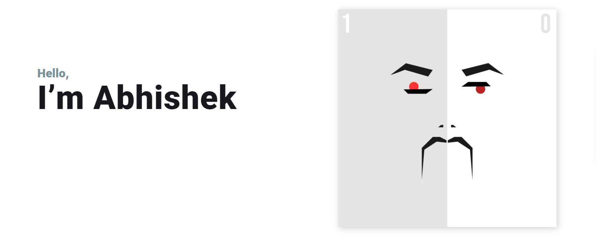

<!--
**abhishek540/abhishek540** is a ✨ _special_ ✨ repository because its `README.md` (this file) appears on your GitHub profile.

Here are some ideas to get you started:

-->

- 🔭 I’m currently working on various Data Analytics related Project
- 🌱 I’m currently learning Data Science, Front-End web development
- 👯 I’m looking to collaborate on Data Science or UI-based Project.
- 🤔 I’m looking for help in statistics and neural network.

- ⚡ Fun fact: I love to code in the morning.- <!-- - 💬 Ask me about anything
- 📫 How to reach me: ...
- 😄 Pronouns: ... -->
---
### Lnaguage:

> **Python, C++, R, JavaScript**

### Tools and Technologies: 

> **Matlab, Sql, Scikit, Tableau**

---
## GitHub Activity

